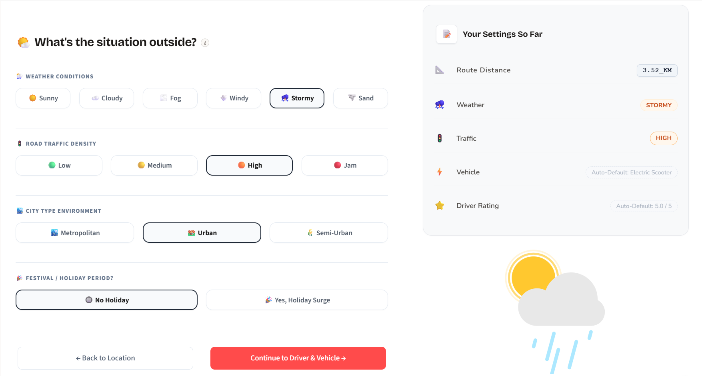

## DropTime  🛵🍕

Ever stared at a food delivery app wondering if "20-30 mins" actually means your fries will arrive soggy? **DropTime** fixes that. It is a machine learning web app that accurately predicts exactly when your food will hit your doorstep, eliminating the guesswork from your hunger timeline.

Most delivery estimates rely on basic distance calculations. DropTime digs deeper. By analyzing restaurant bottlenecks, courier profiles, real-time weather conditions, and vehicle dynamics, it delivers a precise arrival time you can actually plan your hunger around.

👉 **Experience DropTime Live on Streamlit** (https://drop-time.streamlit.app/)

------------------------------
## 🎨 The Vibe Check (UI/UX)
Let's be real: filling out long data forms is exhausting. I designed DropTime to feel less like a clinical spreadsheet and more like an intuitive, fast-paced app.

------------------------------
## 🧠 Data & Model Architecture
To make this viable for real-world production, the engine was built using a rigorous data pipeline:

* **The Dataset**: Trained on the comprehensive Zomato Delivery Dataset from Kaggle, capturing thousands of real-world food delivery trips.
* **The Brains**: Powered by an optimized XGBoost Regressor, chosen for its speed and exceptional ability to handle non-linear feature relationships.
* **Performance**: Achieved an accuracy score of ~93%, striking an ideal balance between high precision and robust generalization.

## Feature Matrix Explored:

* **The Setup**: Spatial data handling using exact restaurant and delivery coordinates.
* **The Environment**: Real-time weather conditions that directly impact traffic flow and braking distances.
* **The Ride**: Vehicle types and specific operational limitations.
* **The Driver Profile**: Courier age and historical performance ratings (because experience matters when navigating rush hour).

------------------------------
## 🚀 Quick Start
Want to spin up the predictive engine locally on your machine? Follow these quick steps.
### Prerequisites
Make sure you have Python 3.10+ installed.
### Installation

   1. Clone the repository:
   
   git clone https://github.com/RaghavBhardwaj18/drop-time
   
   2. Install the dependencies:
   
   pip install -r requirements.txt
   
   3. Launch the Streamlit application:
   
   streamlit run app.py
   
   
------------------------------
## 🛠️ Tech Stack

* Frontend: Streamlit + Custom CSS Animations
* Machine Learning: Python, Scikit-Learn, Pandas, NumPy
* Deployment: Streamlit Community Cloud
